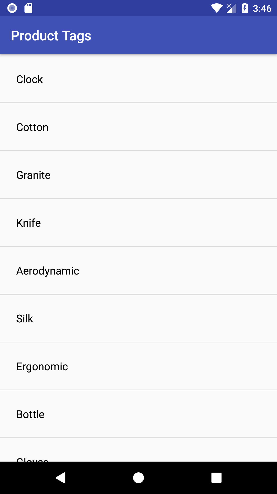
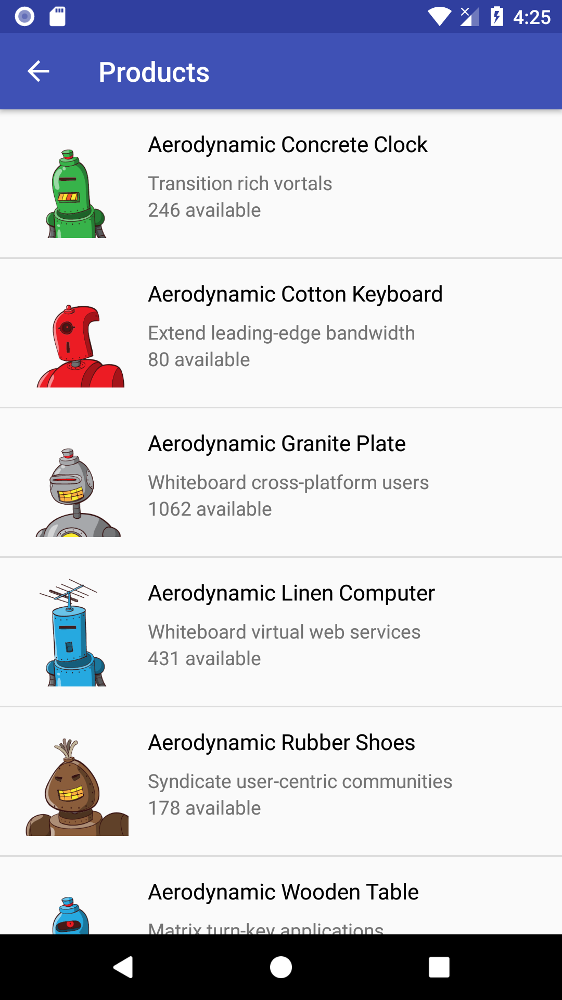

# ShopifyWinter19MobileChallenge

This is my implementation of the Winter 2019 Mobile Internship Challenge. From the API response, a list of all product tags is made. Clicking on any of the product tags, shows a list of its corresponding products.

## Tools Used
<ul>
  <li>Kotlin</li>
  <li>Retrofit</li>
  <li>Picasso</li>
</ul>

## Screenshots

    
    

